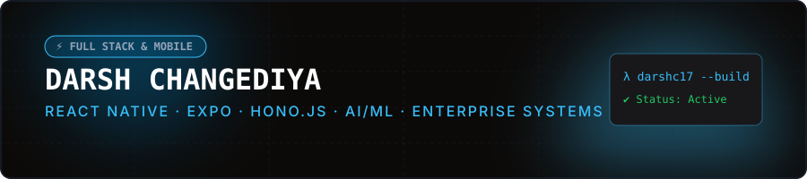
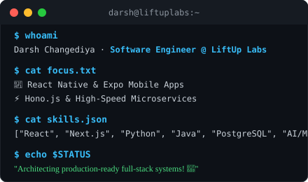
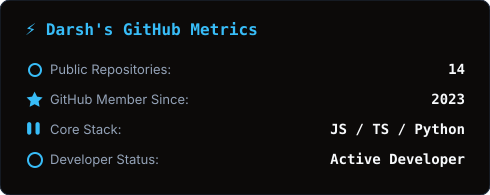
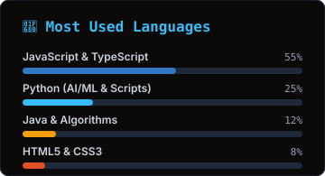
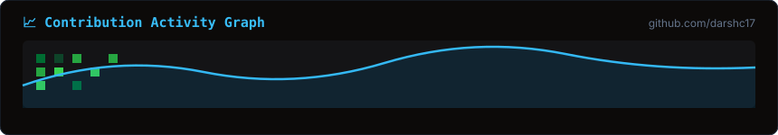

<!-- ⚡ Animated Banner (stored in assets/banner.svg) -->

  

 

<table align="center" border="0">
<tr>
<td width="45%" align="center" valign="middle">

<!-- 🖥️ Animated Terminal Card (stored in assets/terminal.svg) -->

</td>
<td width="55%" valign="middle">

### 👨💻 <b><code>About Me</code></b>

- 💼 <b><code>Experience</code></b> ➔ <b><code>Software Engineer @ LiftUp Labs</code></b>
- 💡 <b><code>Specialization</code></b> ➔ <b><code>Cross-Platform Mobile</code></b> · <b><code>Full-Stack Web</code></b> · <b><code>Backend Microservices</code></b>
- 💬 <b><code>Tech Focus</code></b> ➔ <b><code>React Native</code></b> · <b><code>Expo</code></b> · <b><code>Hono.js</code></b> · <b><code>React</code></b> · <b><code>Python</code></b> · <b><code>Java</code></b> · <b><code>PostgreSQL</code></b>
- 🚀 <b><code>Engineering Mission</code></b> ➔ <b><code>Architecting High-Concurrency Mobile &amp; Production-Grade Systems</code></b>

 

</td>
</tr>
</table>

 

## 🛠️ <b><code>Tech Arsenal</code></b>

### 📱 <b><code>Mobile &amp; Frontend Engineering</code></b>

<table>
<tr>
<td align="center" width="90"> <b><code>React Native</code></b></td>
<td align="center" width="90"> <b><code>Expo</code></b></td>
<td align="center" width="90"> <b><code>React</code></b></td>
<td align="center" width="90"> <b><code>Next.js</code></b></td>
<td align="center" width="90"> <b><code>TypeScript</code></b></td>
<td align="center" width="90"> <b><code>JavaScript</code></b></td>
<td align="center" width="90"> <b><code>Tailwind</code></b></td>
</tr>
<tr>
<td align="center" width="90"> <b><code>HTML5</code></b></td>
<td align="center" width="90"> <b><code>CSS3</code></b></td>
</tr>
</table>

### ⚙️ <b><code>Backend &amp; API Infrastructure</code></b>

<table>
<tr>
<td align="center" width="90"> <b><code>Hono.js</code></b></td>
<td align="center" width="90"> <b><code>Node.js</code></b></td>
<td align="center" width="90"> <b><code>Express</code></b></td>
<td align="center" width="90"> <b><code>Python</code></b></td>
<td align="center" width="90"> <b><code>Java</code></b></td>
<td align="center" width="90"> <b><code>REST APIs</code></b></td>
</tr>
</table>

### 🗄️ <b><code>Databases &amp; Architecture</code></b>

<table>
<tr>
<td align="center" width="90"> <b><code>PostgreSQL</code></b></td>
<td align="center" width="90"> <b><code>MongoDB</code></b></td>
<td align="center" width="90"> <b><code>MySQL</code></b></td>
<td align="center" width="90"> <b><code>SQLite</code></b></td>
<td align="center" width="90"> <b><code>Redis</code></b></td>
<td align="center" width="90"> <b><code>Prisma</code></b></td>
</tr>
</table>

### 🤖 <b><code>AI &amp; Machine Learning Ecosystem</code></b>

<table>
<tr>
<td align="center" width="90"> <b><code>Scikit-Learn</code></b></td>
<td align="center" width="90"> <b><code>TensorFlow</code></b></td>
<td align="center" width="90"> <b><code>PyTorch</code></b></td>
<td align="center" width="90"> <b><code>Pandas</code></b></td>
<td align="center" width="90"> <b><code>NumPy</code></b></td>
<td align="center" width="90"> <b><code>Jupyter</code></b></td>
</tr>
</table>

### ☁️ <b><code>DevOps, Cloud &amp; Tooling</code></b>

<table>
<tr>
<td align="center" width="90"> <b><code>Docker</code></b></td>
<td align="center" width="90"> <b><code>Git</code></b></td>
<td align="center" width="90"> <b><code>GitHub</code></b></td>
<td align="center" width="90"> <b><code>CI/CD</code></b></td>
<td align="center" width="90"> <b><code>Linux</code></b></td>
<td align="center" width="90"> <b><code>Postman</code></b></td>
</tr>
</table>

 

## 🚀 <b><code>Featured Deployments</code></b>

| 🎯 <b><code>Project</code></b> | 📝 <b><code>Architecture &amp; System Capabilities</code></b> | 🧰 <b><code>Stack</code></b> |
|:---|:---|:---:|
| 🏢 <a href="https://github.com/darshc17/ProTrack-Elite" target="_blank" rel="noopener noreferrer"><b><code>ProTrack-Elite</code></b></a> | 📈 <b>Developer Productivity &amp; Project Tracking Platform</b> engineered for high-throughput task workflows &amp; task state synchronization. | `JavaScript` `React` `Node.js` |
| 🦷 <a href="https://github.com/darshc17/dental_erp" target="_blank" rel="noopener noreferrer"><b><code>Dental ERP System</code></b></a> | 🏥 <b>Enterprise Clinic Management Suite</b> featuring patient records management, dynamic appointment scheduling &amp; billing pipelines. | `TypeScript` `React` `Node.js` |
| 🚀 <a href="https://github.com/darshc17" target="_blank" rel="noopener noreferrer"><b><code>LiftUp Labs Mobile &amp; Microservices</code></b></a> | ⚡ <b>Cross-Platform Mobile Applications</b> powering enterprise workflows with <b>Expo</b> &amp; ultra-fast <b>Hono.js</b> microservice APIs. | `React Native` `Hono.js` `PostgreSQL` |
| 🎵 <a href="https://github.com/darshc17/music-genre-classifier" target="_blank" rel="noopener noreferrer"><b><code>Music Genre Classifier</code></b></a> | 🎧 <b>AI/ML Audio Processing Pipeline</b> categorizing music tracks using acoustic feature extraction, spectrogram analysis &amp; ML classification. | `Python` `AI/ML` `Pandas` |
| 🌳 <a href="https://github.com/darshc17/heap-visualizer" target="_blank" rel="noopener noreferrer"><b><code>Heap Visualizer</code></b></a> | 🧠 <b>Interactive Algorithm Execution Visualizer</b> rendering binary heap tree structures, heapify transformations &amp; sorting animations. | `JavaScript` `Algorithms` `CSS3` |

 

## 📊 <b><code>Engineering Analytics</code></b>

<!-- Streak stats -->

  

<!-- Stats & Top Languages cards (stored in assets/stats.svg and assets/langs.svg) -->
<table align="center" border="0">
<tr>
<td></td>
<td></td>
</tr>
</table>

 

<!-- 📈 Contribution Activity Graph (stored in assets/activity.svg) -->

 

<blockquote align="center">
<h3>💡 <b><code>Developer Philosophy</code></b></h3>
<b><code>Build</code> ➔ <code>Break</code> ➔ <code>Learn</code> ➔ <code>Improve</code> ➔ <code>Repeat</code></b>
  
<i>"The most effective way to master technology is by <b>engineering real systems</b>, solving <b>hard problems</b>, and continuously raising the bar of excellence."</i>
</blockquote>

 

 

<b>⭐ <code>If you find my work interesting, feel free to explore and star my repositories!</code> 🚀</b>

